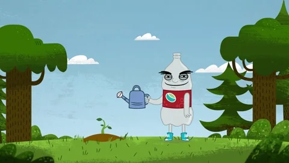
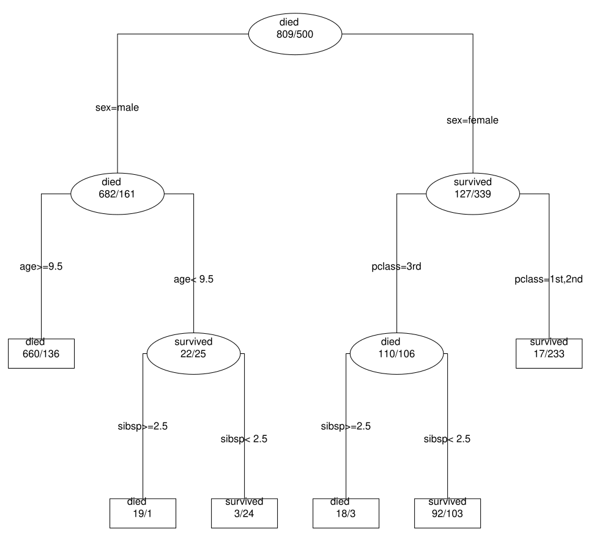
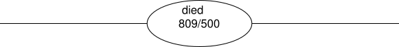
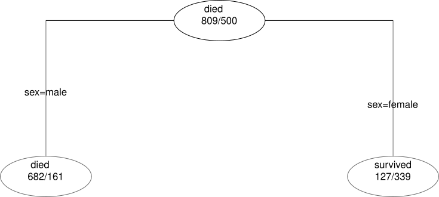
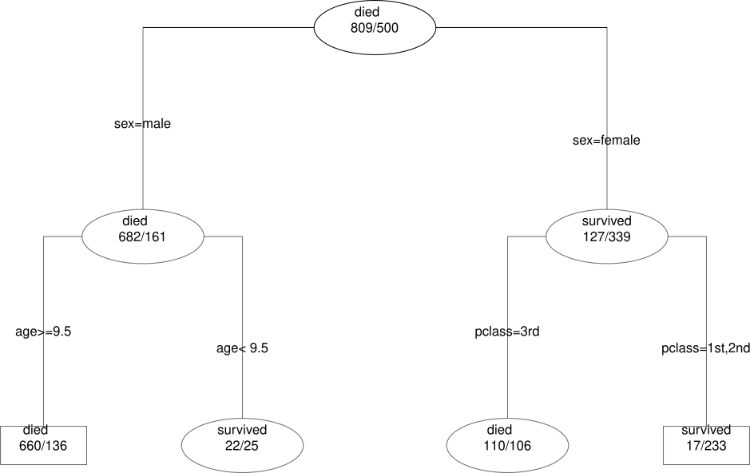
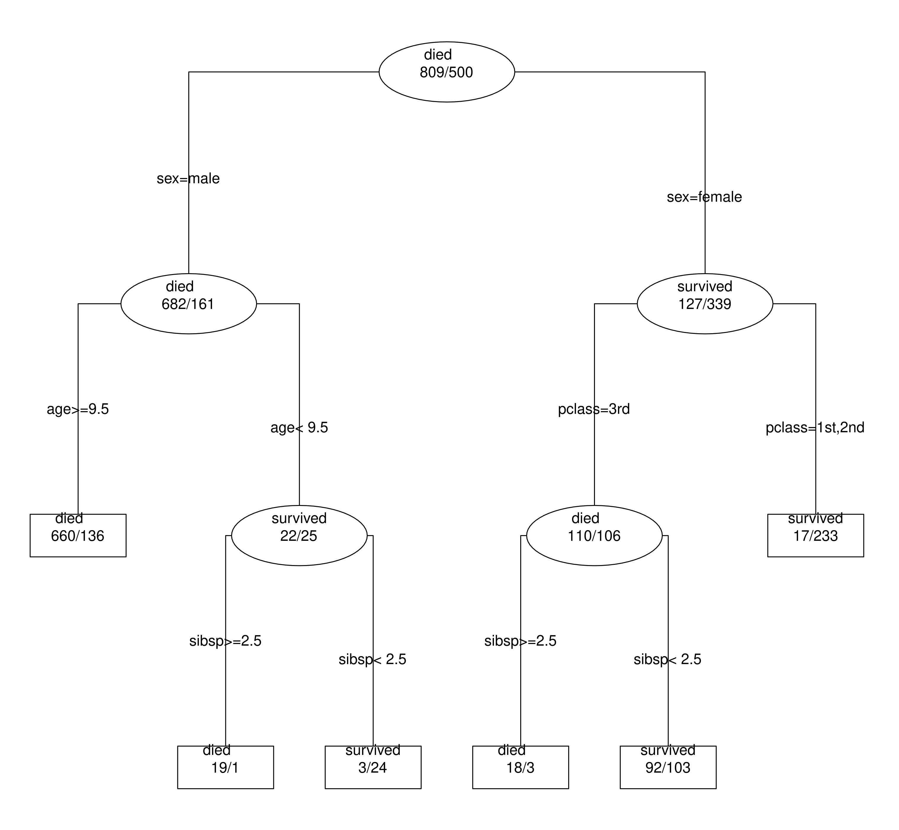
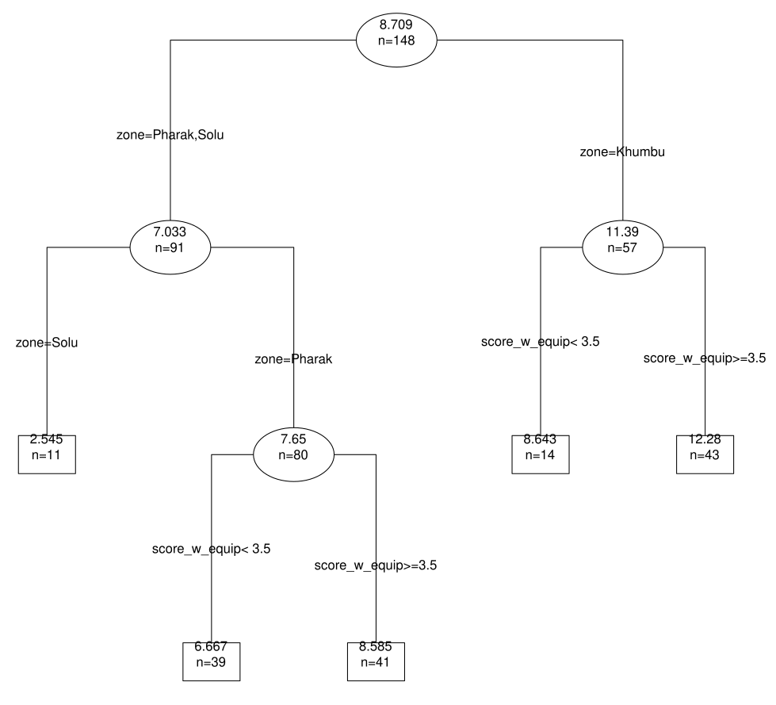
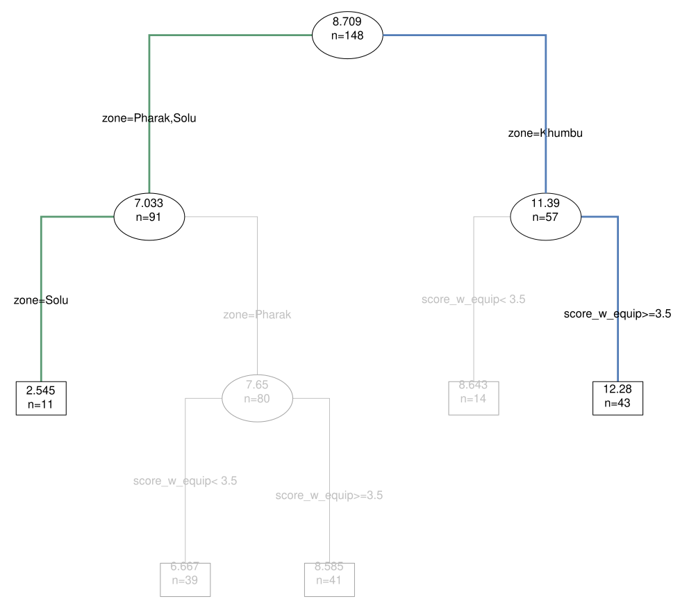
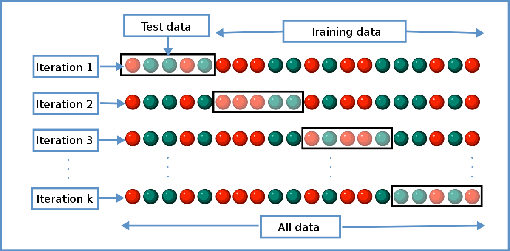

```{r setup, echo=FALSE}
library(knitr)


```


class: center, middle, inverse

# Contenu de l'Atelier

I- Présentation des principes généraux d'un arbre de décision

      A- Présentation théorique
      B- Avantages et limites
      C- Fonctionnement des arbres
II- Exemple et décryptage d'un arbre

III-BaobARD : application shiny pour réaliser ses premières explorations

IV- Travaux pratiques

V- Un peu de code... éventuellement

---

class: center, middle, inverse


# Présentation des arbres de décision


---
### Les arbres de décision c'est quoi ? I

Les arbres de décision font partie du champs très à la mode du machine learning.
  > Très simplement, le machine learning à pour objectif de chercher des patterns et d’effectuer des prédictions à partir de données en se basant sur des statistiques.
  
Le machine learning regroupe un ensemble de méthodes qui se divise en 2 grandes catégories : les méthodes d'apprentissage non-supervisé et les méthodes d'apprentissage supervisé.
  > Les arbres de décision font partie des méthodes d'apprentissage supervisé

L'objectif des méthodes d'apprentissage supervisé est d'inférer la relation entre différentes variables à partir d'un échantillon d'apprentissage.

.small[.full-width.content-box-blue[Ainsi par exemple, si j'ai un ensemble d'information comme l'âge, le poid, le sexe et la taille, je peux mettre en oeuvre un modéle d'apprentissage supervisé pour prédire le poid en fonction des autres variables.]]

---
### Les arbres de décision c'est quoi ? II


Très concrétement l'arbre de décision c'est :

.important[
Un outil permettant de prédire ou expliquer les valeurs prisent par une variable, que vous aurez choisie, en fonction d'un ensemble d'autres variables que vous aurez sélectionnées.]

Par ailleurs :

 ► Si la variable que vous souhaitez prédire est qualitative on parlera d'**arbre de classification**.

 ► En revanche, si la variable étudiée est quantitative alors on parlera d'**arbre de régression**.


---

### Pourquoi les arbres de décisions ? 

L'objectif d'un arbre de décision est donc de prédire les valeurs prisent par une variable.
Mais il existe d'autres tests statistiques plus connus qui ont le même objectif, comme notamment les tests de régression.
  > .small[Comme pour les arbres de décision, la régression  cherche à prédire une variable à l'aide d'un ensemble d'autres variables et voir parmi ces prédicteurs ceux qui ont le plus d'effet sur notre variable cible.]

Pourquoi alors ne pas utiliser simplement les techniques de régression ?
  > .small[Notamment car ces méthodes sont assorties de conditions qu'il faut remplir pour être considérées comme fiable :]
 
 .small[.full-width.content-box-blue[Par exemple : distribution normale des résidus, homogénéité des résidus, non multicolinérarité...]]


---
class: center, middle

Tenter de remplir les différentes conditions requises ressemble très souvent à un parcours du combattant :


---

### Les avantages de l'arbre de décision

.small[L'arbre de décision posséde donc l'avantage certain de ne pas avoir à se préoccuper des conditions citées précédemment.]

.small[Par ailleurs il posséde également d'autres avantages...]

--

.small[1. Il peut servir à expliquer une variable qualitative (il s'agit d'un arbre de classification) aussi bien que quantitative (il s'agit d'un arbre de régression).
1. Il peut s'inscrire dans une approche mixte, on peut mélanger dans nos prédicteurs des variables continues, ordinales et binaires.
1. On peut introduire un grand nombre de variables dans notre modèle sans craindre de perturbations des variables sans effet. L'algorithme de production de l'arbre va selectionner les meilleurs prédicteurs possibles pour expliquer notre variable.
1. Gestion efficace des données manquantes qui, même en assez grand nombre, ne posent pas de problèmes majeurs.
1. L'algorithme de production n'est pas gourmand en ressources, peu de risque de faire planter l'ordinateur.
1. Produit une visualisation simple d'interprétation et connue bien au delà du monde de la data science, qui permet de rendre compte des éventuelles interactions complexes entre les variables de notre base de données.
]
---

### Les avantages de l'arbre de décision... et ses limites

L'arbre de décision offre donc une solution alternative plutôt intéressante et séduisante aux problèmes que peuvent poser les méthodes "classiques".

Toutefois il n'est bien sûr pas parfait :

--
.small[
► Dans un monde idéal avec des données idéales (grands échantillons, 0 données manquantes, prédicteurs forts et non corrélés, distribution normale des résidus...) l'arbre de décision sera moins bon en prédiction que les méthodes multivariées (régression etc.)]

--
.small[
► Sa production peut s'avérer assez simple mais son interprétation complexe.]

--
.small[
► Vous n'aurez pas d'indicateurs ou de coefficients vous donnant l'importance ou le niveau des effets de tel ou tel prédicteur.]

---

### En bref

Ce qu'il faut retenir :

.important[
L'arbre de décision est donc une méthode "tout-terrain" lorsque l'on doit faire de la prévision avec des données de qualité moyenne qui sont globalement la norme en SHS.
Et il est surtout particulièrement adapté à **l'exploration des données**.
]

---

class: center, middle, inverse


# L'arbre de décision comment ça pousse ?


---
### Petit traité d'arboriculture I

.small[L'idée générale est que l'algorithme de production des arbres de décision va obéir à un principe de partitionnement récursif.]

.important[
Le but de l'arbre va être de créer des groupes d'individus les plus homogènes possible entre eux par rapport à la variable étudiée.
]

.small[Pour ce faire l'algorithme va "poser" des questions binaires (dont la réponse est oui/non) en lien avec les variables que vous aurez définies comme prédicteurs.
  > Ce sont les réponses à ces questions binaires qui constitueront les différentes ramifications de l'arbre.]

.small[Nous l'avons évoqué précedemment l'algorithme de l'arbre de décision va choisir les meilleurs prédicteurs possibles parmi l'ensemble des variables prédictrices que vous aurez choisies.]

.full-width.content-box-blue[.small[Le corollaire est qu'il est possible que certains des prédicteurs que vous avez séléctionnés ne soient pas retenus par l'algorithme de l'arbre.]]
---
### Petit traité d'arboriculture II

.small[Pour y voir plus clair prenons un exemple et segmentons le processus de "pousse" en plusieurs étapes :
]
.small[Voici un arbre de décision qui cherche à prédire la survie des passagers du Titanic]


```{r, echo=FALSE, out.width = "60%", fig.align='center'}

```

---
### Etape 1

1- .small[L'arbre pousse à partir de sa base constituée de l'ensemble des individus qui composent votre jeu de données. On parle de la racine de l'arbre.]

```{r, echo=FALSE, out.width = "70%", fig.align='center'}

```
---
### Etape 2

2- .small[Une première question relative à l’une des variables prédictives sépare notre jeu de données en deux groupes.]

  >.small[Le choix de la question est fait de façon à ce que la réponse à la question permette d’obtenir 2 groupes les plus homgènes possibles. C’est à dire le plus homogène possible en leur sein et différents l’un de l’autre.]
  
```{r, echo=FALSE, out.width = "70%", fig.align='center'}

```

---
### Etape 3

3- .small[Chacun des deux groupes obtenus peut à son tour être séparé en deux en choisissant à nouveau la meilleure question possible à poser à l'aide du meilleur prédicteur possible. La question va varier en fonction des sous-groupes d'individus.]

```{r, echo=FALSE, out.width = "70%", fig.align='center'}

```

---
### Etape 4 et 5

4- .small[Le processus est répété récursivement !]

5- .small[Lorsque l’arbre a atteint sa taille optimale, c’est à dire lorsque les divisions ne permettent plus d’obtenir des groupes suffisament homogènes et différents les uns des autres, alors le processus s’arrête. Ces groupes d'individus finaux constituent les feuilles de l’arbre.]

```{r, echo=FALSE, out.width = "50%", fig.align='center'}

```

---
### Petit traité d'arboriculture III

Il reste encore cependant à répondre à 3 questions fondamentales !

--

► Comment sont choisies les meilleures questions possibles pour constituer nos branches de l'arbre ? Et donc l'utilisation de tel ou tel prédicteur.

--

► Comment est décidée la taille optimale de l'arbre ?

--

► Comment interprète t-on ces groupes finaux d'individus ? Une fois nos groupes définitifs d'individus produits, quel genre de modèle est crée pour chacun d'entre eux. 

---
class: center, middle, inverse

# Est ce que ça va ?


---
class: center, middle, inverse

# Utilisons un exemple !


---
### Exemple 1 : un arbre de classification
.small[Pour ce 1er exemple, reprenons notre cas sur les survivants du Titanic !]

```{r, echo=FALSE, out.width = "70%", fig.align='center'}

```

---
### Décryptage

Nous cherchons à expliquer ce qui prédirait la survie de notre échantillon de passagers. Nos prédicteurs : la classe économique de la cabine, l'âge, le genre, le nombre de parents/enfants à bord, et le nombre de frères/soeurs/conjoints à bord.

1- .small[Tout en haut c'est la racine de l'arbre qui regroupe tous nos individus, c'est le point de départ.]

```{r, echo=FALSE, out.width = "60%", fig.align='center'}

```

Chaque groupe et sous-groupe d'individus d'un arbre de classification se lit de la même manière. On a d'abord la modalité la plus représentée dans le groupe, suivie du nombre d'individus possédant les différentes modalités de la variable que nous cherchons à prédire.


---
### Décryptage

2- .small[Un premier découpage est fait selon la meilleure variable possible pour séparer nos données en deux groupes homogènes : ici la variable "sex".] 

```{r, echo=FALSE, out.width = "70%", fig.align='center'}

```

Les individus satisfaisant la condition "male" formeront la ramification de gauche et constitueront un sous groupe ou la modalité décès est plus importante (avec 682 hommes qui perdront la vie durant le naufrage et 161 qui en réchapperont). Les individus satisfisant la modalité "female" formeront un autre sous-groupe ou la modalité survie est la mieux représentée avec 339 femmes qui survivront et 127 périront durant le naufrage.
---
### Décryptage
3- .small[Pour chaque sous-groupe le découpage se poursuit de manière récursive jusqu'à ce que l'arbre est atteint sa taille optimale.]

```{r, echo=FALSE, out.width = "40%", fig.align='center'}

```

Ainsi, les individus qui satisfont successivement les critères "sex" = "male" et "age">= "9.5  appartiendront à un sous-groupe ayant davantage de chance de ne pas survivre au naufrage avec 660 individus qui sont morts et 136 qui ont réussi à survivre. On note que les ramifications d'un arbre de décision peuvent être de longueurs différentes

---
### Exemple 2 : un arbre de régression

.small[Nous allons maintenant passer à un nouveau exemple et tenter de prédire le nombre d'équipements électriques de lodges situés au Népal. La variable étant quantitative il s'agira d'un arbre de régression.]

```{r, echo=FALSE, out.width = "60%", fig.align='center'}

```


---
### Décryptage

.small[Pour ce faire nous intégrons à notre arbre 4 prédicteurs : la zone du Népal dans laquelle se situe notre lodge, la caste du propriétaire, le genre du propriétaire et le nombre d'équipements raccordés à l'eau.]

.important[.small[
L'arbre de régression se lit exactement de la même manière qu'un arbre de classification !]]

.small[En revanche l'information fournie pour chaque sous-groupe d'individu ne va pas être tout à fait identique.]

.full-width.content-box-blue[.small[Dans un arbre de régression on obtiendra pour chaque sous-groupe le nombre d'individus composant le sous-groupe (n=) et la valeur moyenne de la variable que nous cherchons à prédire pour le sous-groupe.]]

---
### Décryptage

.small[Dans cette exemple on note que les lodges situés dans le Solu seront ceux ayant le nombre d'équipements électriques le plus faible, 2.5 en moyenne et cela correspond à 11 individus. Alors que ceux du Pharak avec un score d'équipements raccordés à l'eau supérieur ou égal à 3.5, auront un nombre moyen d'équipements électriques de 8.5]

```{r, echo=FALSE, out.width = "55%", fig.align='center'}

```

---
### Quel modèle pour nos sous-groupes d'individus

.small[Cette question du modèle créé pour chaque groupe d'individus renvoie simplement à comment interpréter ces groupes.
  > Quelle valeur attribuer à chaque groupe d'individus ?]

.important[
.small[Le coeur de l'interprétation est lié au principe même de création des arbres de décision : subdiviser nos données en sous-groupe les plus homogènes possible en leur sein (concernant la variable étudiée) et différents les uns des autres]]

.small[Comme les sous-groupes d'individus sont supposées suffisamment homogènes ont fait très généralement le choix d'un ajustement par une constante. ]

► .small[Pour les arbres de régression ce sera le plus souvent la moyenne de la variable que nous cherchons à prédire.]

► .small[Pour les arbres de classification, la modalité la mieux représentée (donc la probabilité d'obtenir cette modalité) de la variable que nous cherchons à prédire.]

---
### Comment sont choisis les prédicteurs ?

Cette question du prédicteur renvoie au découpage en sous-groupe d'individus de notre arbre de décisison.

L'objectif de chaque découpage est de réduire l'erreur de prédiction de l'arbre de décision.

Ainsi, l'algorithme va chercher le prédicteur qui permet de réduire le plus cette erreur de prédiction
  > Pour ce faire l'algorithme va tout simplement essayer tous les découpages possibles avec tous les prédicteurs.
  
.full-width.content-box-blue[.small[C'est donc l'algorithme de l'arbre qui va choisir le prédicteur à utiliser, parmi la liste des prédicteurs, pour découper un groupe d'individus en deux nouveaux sous-groupes]]

---
### Comment sont choisis les prédicteurs ? II

Reprenons notre arbre de regression sur les équipement électriques des lodges:

```{r, echo=FALSE, out.width = "70%", fig.align='center'}

```

---
### Comment sont choisis les prédicteurs ? III

.small[Pour définir le groupe d'individus ayant le nombre d'équipements électriques le plus faible (en vert) l'algorithme va chercher à scinder nos individus en sous-groupes.]

.small[Pour ce faire il va tester toutes nos variables prédictrices et ne retenir que celles étant les plus efficaces pour réduire l'erreur de prédiction et constituer les groupes les plus homogènes.
  > Pour prédire les lodges ayant le score le plus faible c'est la variable zone, qui utilisé 2 fois de suite, permettra la meilleure réduction de l'erreur de prédiction.]
  
.small[Ce principe s'applique pour chaque ramification de l'arbre de décision.
 > Pour prédire le groupe des individus ayant le nombre d'équipements électriques le plus élevé (en bleu) la combinaison de deux prédicteurs sera nécessaire : la zone et le nombre d'équiment raccordé à l'eau.]
  
.full-width.content-box-blue[.small[On notera que ni le genre ni la caste ne sont utilisés comme variables discriminantes pour constituer nos sous-groupes.]]

---
### Quand l'arbre de décision a-t-il atteint sa taille optimale

.important[
.small[L'objectif du découpage optimal est à la fois de réduire l'erreur de prédiction tout en évitant un surajustement où chaque feuille terminale est composée d'un unique individu.]]

Pour stopper l'arbre il existe 4 critères différents.

.small[1. Obliger chaque feuille terminale à contenir un nombre minimal d’individus .
1. Ne pas dépasser un nombre de feuilles fixé à l’avance.
1. Retenir le nombre de feuilles permettant de minimiser l’erreur de prédiction à l'aide de la validation croisée.
1. Interrompre le processus lorsqu’une division supplémentaire n’aboutirait pas à une diminution "sensible" de l'erreur de prédiction.]

.small[Les deux premiers critères sont relativement proches et il n'y a pas de règles les concernant hormis le bon sens et votre connaissance des données.
C'est en général le 3ème critère qui est privilègié.
Quant au critère numéro 4, il est quasiment impossible à definir à l'avance avant la réalisation de l'arbre. Nous ne l'aborderons pas ici]

---
### Point sur le critère 3 : la validation croisée

.small[La validation croisée (cross-validation en anglais) est un sujet complexe que nous ne ferons que survoler ici. Ce qu'il faut retenir : ]

.full-width.content-box-blue[.small[La validation croisée désigne un processus qui permet de tester la qualité de prédiction d'un modèle. Il existe plusieurs méthodes mais la plus populaire est la validation croisée à k blocs (k-fold cross-validation en anglais).Son principe : on divise notre échantillon avec d'un côté une partie qui servira pour entrainer le modèle et une autre partie sur laquelle sera testé le modèle. On répète cette opération x fois avec des échantillons de tests de même taille mais sélectionnés aléatoirement parmi nos individus et des échantillons d'entrainement qui devront également avoir la même taille et être sélectionnés aléatoirement.]]


```{r, echo=FALSE, out.width = "50%", fig.align='center'}

```

---
### Point sur le critère 3 : la validation croisée II

.small[Notre modèle va donc tourner autant de fois que nous avons décidé de scinder notre groupe d'individus en groupes test VS entrainement.]
> .small[A l'issue du processus de validation croisée l'algorithme arrivera à un compromis entre la diminution de l'erreur de prédiction et le surajustement.]


.small[Classiquement, l’erreur de prédiction diminue constamment lorsque le nombre de sous-groupes augmente. Alors que l'erreur de prédiction obtenue en validation croisée va diminuer puis réaugmenter.]

.important[
.small[C'est ce seuil où l'erreur obtenue en validation croisée remonte qui fournit le fameux compromis et qui définit le nombre de découpage optimale et donc la taille optimal de l'arbre.]]

---
### Point sur le critère 3 : la validation croisée III

Ce calcul du seuil de coupure optimal peut également apparaitre sous la dénomination de calcul de compléxité.

Il existe deux manières pour le visualiser  :

►  Avec un tableau

►  Avec un graphique

.full-width.content-box-blue[Il existe dans R des moyens pour récupérer le seuil exact à partir du tableau ou du graphique]

---
### La voie littérale (avec R)

Vous avez ici le nombre de découpage et la réduction de l'erreur de prédiction correspondante. L'erreur de prédiction en validation croisée correspond au **xerror**

```{r, echo=FALSE, warning=FALSE}

library(rpart)
library(rpart.plot)

data(ptitanic)

arbre1 <- rpart(survived ~., data=ptitanic)

printcp(arbre1)
```

---
### La voie graphique (avec R)

```{r, echo=FALSE, warning=FALSE}

library(rpart)
library(rpart.plot)

data(ptitanic)

arbre1 <- rpart(survived ~., data=ptitanic)

plotcp(arbre1)
```


---

class: center, middle, inverse

# Ouf ! Fini pour la théorie !


---
class: center, middle, inverse

# Maintenant la pratique !


BaobARD, une application shiny pour faire des arbres sans coder !

- https://frama.link/BaobARD_01
- https://frama.link/BaobARD_02

---
class: center, inverse
background-image: url(images/baobard_apropos.png)
background-size: contain

.small[En suivant le lien vous arriverez sur cette première page qui donne quelques informations sommaires sur l'application et sur les arbres de décision.]

---
class: center, inverse
background-image: url(images/baobard_import.png)
background-size: contain

.small[La page **Import des données** vous permet de charger vos données et de les visualiser.]

---
class: center, inverse
background-image: url(images/baobard_analyse.png)
background-size: contain

.small[C'est donc ici que les analyses vont se faire, diverses options sont disponibles. Mais surtout le plus important c'est là qu'il faudra choisir la variable à étudier et les variables qui feront office de prédicteurs.]

---
class: center, inverse
background-image: url(images/baobard_analyse.png)
background-size: contain

.small[Le 1er onglet est **Arbre brut**, il s'agit de la première visualisation brute de votre arbre, c'est à dire avec les paramètre par défaut. Un export en png, pdf et svg est possible.]

---
class: center, inverse
background-image: url(images/baobard_complexite.png)
background-size: contain

.small[Le 2ème onglet **Complexité**, permet de visualiser le graphique de l'erreur de prédiction en validation croisée.  Baobard vous fournira le niveau de coupure optimal de l'arbre issue du calcul de compléxité. ]

---
class: center, inverse
background-image: url(images/baobard_elague.png)
background-size: contain

.small[Le 3ème onglet **Arbre élagué**, permet de visualiser votre arbre à sa taille optimale à l'aide du niveau de "coupe" obtenu dans l'onglet **Compléxité**. Il se peut que l'arbre élagué ait la même forme que l'arbre brut. Un export au format pdf, png et svg est possible.]

---
class: center, inverse
background-image: url(images/baobard_construction.png)
background-size: contain

.small[Le 4ème onglet **Régle de construction**, permet une lecture littérale de votre arbre.]

---
class: center, inverse


.small[Comment les régles de constructions se lisent ?
D'abord le numéro du noeud, puis le critère de division et le nombre total d'individus du groupe. Ensuite on aura une différence entre arbre de classification et arbre de régression.]

.small[Pour les arbres de classification viendra ensuite, le nombre des individus n’appartenant pas à la modalité prédite, la modalité prédite (c’est à dire majoritaire), et enfin entre parenthèse la proportion des individus bien et mal classés.]

.small[Pour les arbres de régression ce sera ensuite la somme des carrés des écarts à la valeur prédite pour les valeurs de toutes les instances du noeud. Puis la moyenne du groupe. ]

.small[Si une ligne se termine par un * c’est qu’il s’agit d’une feuille terminale]

---
class: center, inverse
background-image: url(images/baobard_interactif.png)
background-size: contain

.small[Le 5ème onglet **Arbre intéractif**, permet de visualiser votre arbre élagué sous forme intéractive, ce qui permet éventuellement de faciliter la lecture et l'analyse de votre arbre.]

---
class: center, middle, inverse

# Un peu de R ?


---
### Un peu de code

Pour les aventuriers qui veulent se lancer sur R, voici les lignes de codes qui traduisent au minimum ce dont nous venons de parler.


```{r, eval=FALSE}

install.packages(c("rpart", "rpart.plot")) # pour installer les deux librairies

library(rpart) #charger la librairie dans R
library(rpart.plot) #charger la librairie dans R

data(ptitanic) #charger les données exemple sur le Titanic (contenu dans la librairie rpart.plot)

View(ptitanic) #visualiser les données

arbre1 <- rpart(survived ~ sex + age + pclass + sibsp + parch, data=ptitanic) # notre arbre de décision

plot(arbre1, compress=TRUE, margin=0.09, uniform=TRUE) #produire le squelette de l'arbre

text(arbre1, pretty=1, fancy=TRUE, all=TRUE, use.n=TRUE) # rajouter au squelette le texte nécessaire à sa lecture


```

---
class: center, middle, inverse

# Un petit bonus


---
### Survol très superficiel des forêts aléatoires

Les forêts aléatoires (ou random forest) sont une extension des arbres de décisions visant à être encore plus efficace sur de la prédiction.

.important[
Le principe sous-jacent est plutôt simple, une multitude de modèles faibles et simples une fois combinés formeront un modèle robuste!]


On est dans la famille des algorithmes qui font de l’aggrégation de modèles, l'algorithme va construire une “forêt” d’arbre de décision, c’est à dire plusieurs centaines voire milliers, construite de manière aléatoire. 

Finalement absolument tout est dans le nom!

---
### Survol très superficiel des forêts aléatoires II

.small[La partie aléatoire du random forest concerne la construction de chaque arbre de décision de notre forêt.]

.small[.full-width.content-box-blue[Pour chaque arbre conçu dans notre modèle un échantillon aléatoire d’individus est sélectionné et la construction d’un sous-groupe  se fait sur un sous-ensemble de variales lui aussi selectionné aléatoirement.]]

.small[Une fois le modèle élaboré, tous les arbres de décision vont tourner sur les données. Et on aura donc des prédictions différentes pour chaque individu !]

.small[L'estimation finale sera :

► La modalité la plus fréquente si le modèle est basé sur des arbres de classification.

► La moyenne des valeurs prédites si le modèle est basé sur des arbres de régression.]

